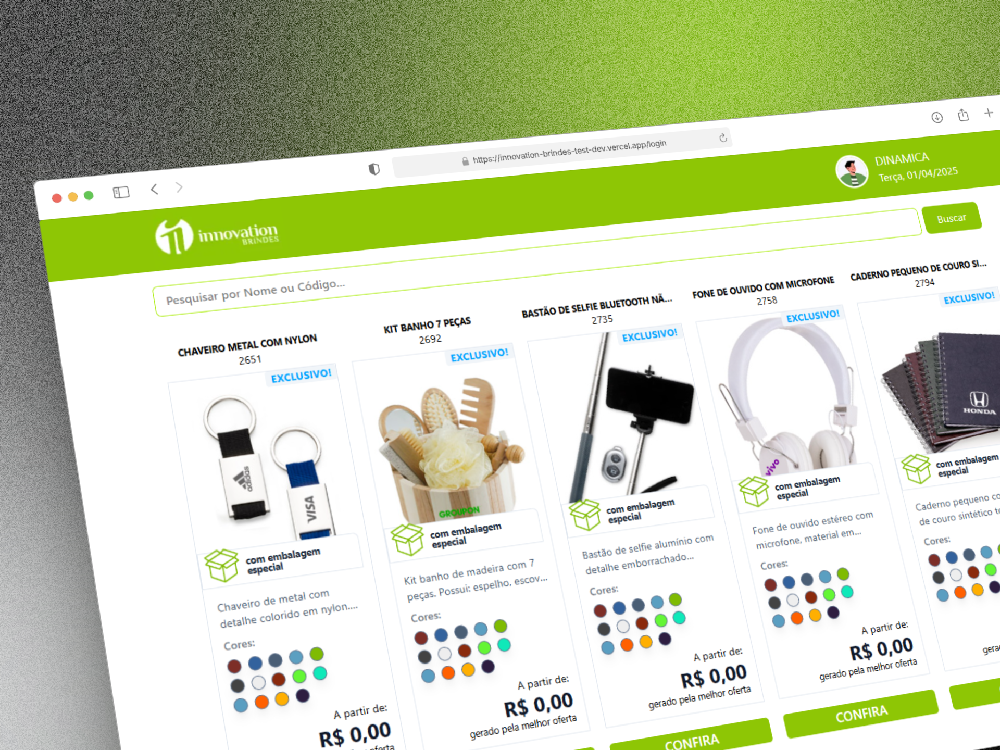

## Innovation Brindes NextJS Test
##### Teste para vaga de desenvolvedor FrontEnd na empresa Innovation Brindes



### Teste Prático - React/Next
#### Aplicação:

O desafio do teste era sobre criar uma aplicação utilizando NextJS com ServerSide com os seguintes requisitos:
- "A aplicação deve prover um sistema de Login validando o acesso pelo endpoint
de autenticação."
- "Após o login, chamar o endpoint de listagem de produtos e montar os cards de
produto."
- "Na tela de produto é necessário utilizar o endpoint de listagem de produtos com
filtro para trazer os produtos conforme os filtros/parâmetros utilizados."
- "Seguir a base de layout do .psd, porém sinta-se livre para seguir sua criatividade
e alterar/fazer melhorias."

O projeto está diponível com deploy via vercel e você pode [ver por aqui!](https://innovation-brindes-test-dev.vercel.app/produtos)

#### Demais Requisitos:
- Ser capaz de gerar um docker da aplicação para fácil avaliação e teste
- Utilizar boas práticas do NextJS
- Utilizar StyledComponents, Chackra UI ou Tailwindcss

#### Estrutura do Projeto
```bash
innovation-test/
├── app/                   
├── components/            
├── public/                
│   └── screenshot.png     
├── service/               
├── utils/                 
│   └── convertCurrency.js 
│── dockerfile          
│── docker-compose.yml  
├── node_modules/          
├── next.config.mjs        
├── postcss.config.mjs     
├── package.json           
├── jsconfig.json          
├── .dockerignore          
├── .gitignore             
└── README.md              
```

#### Como rodar localmente

##### Via Docker

```bash
  docker-compose up --build
```

No ambiente Windows com WSL (meu caso)

```bash
  wsl
  docker-compose up --build
```

##### Via Npm

```bash
  npm install OU yarn install ...
  npm run dev OU yarn dev ...
```